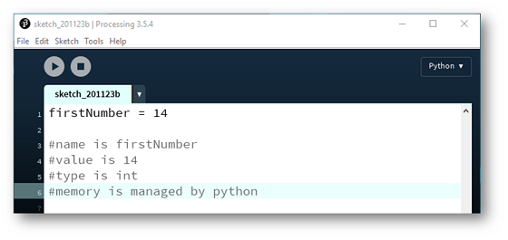
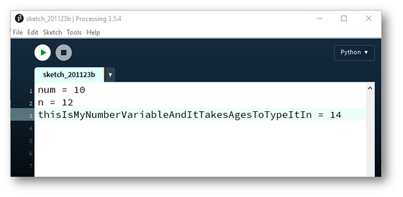
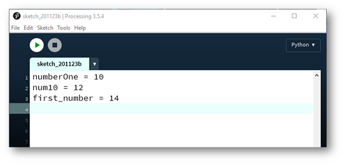
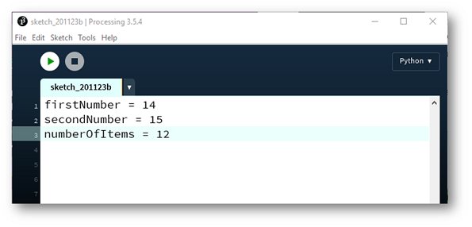
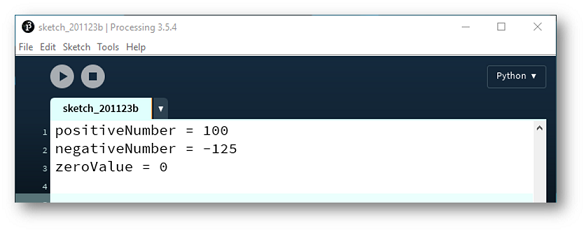
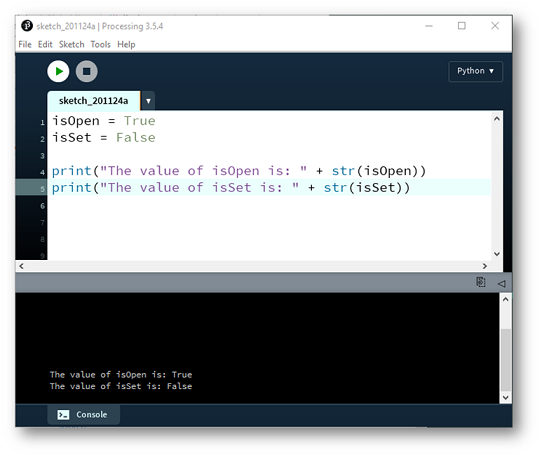

# Variables

Variables are defined in your programs.  Each Python variable has:

- name of the variable
- value of the variable
- data type of the variable
- address (in computer memory) of the variable.

Please read the below content...in the next step, we will start coding!

## Defining Variables

To create a variable, you give it a name and a value e.g.:

## Variable Names

When you are creating variables, you can use:

- letters, both upper and lower case
- digits (0-9) and 
- underscores _

If your variable name contains more than one word, you should use camelCase.  This means that the first word begins with a lower case letter and every other word begins with an uppercase letter e.g.

##Data Types

Each variable has a data type.  In Python, there are four primitive data types:

- Integer
- Float
- String
- Boolean

###Integer Data Type

An Integer is a whole number that can hold negative numbers, positive numbers and zero.

###Float Data Type

A Float is a floating decimal point that can hold both negative and positive numbers. 

### String Data Type

A String is a sequence of characters inside double or single quotes. 

### Boolean Data Type

A Boolean holds a value of either True or False.

We will now code with each of these datatypes in turn.