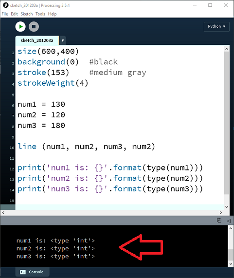

# Integer Data Types

An Integer is a whole number that can hold negative numbers, positive numbers and zero.

## Using Integer Variables

In VS Code, create a new Python file (use **File > New File** and save it with a `.py` extension).  Enter the following code — avoid the temptation to cut and paste; type it in.  The more mistakes you make when typing code, the more you will learn!

~~~python
num1 = 50
num2 = 120
num3 = 180

print(num1)
print(num2)
print(num3)
~~~

In the above code, we created three **Integer** variables, *num1*, *num2* and *num3*.  They are Integers because we assigned a whole number to them.  We then used the *print* function to display each variable's value in the terminal.

Run the file (right-click in the editor and choose **Run Python File in Terminal**, or use the Run button).  You should see the three values printed in the terminal:

~~~
50
120
180
~~~

Now update the value for *num1* from 50 to 130.  When you run the code again, you will see the updated value printed.

## Checking a variable's data type

You can check the type of your variables by adding the following code after your print statements:

~~~python
print('num1 is: {}'.format(type(num1)))
print('num2 is: {}'.format(type(num2)))
print('num3 is: {}'.format(type(num3)))
~~~

Run your code and you should see output similar to this appearing in the terminal:

The `type()` function returns the data type of the variable.  We will cover what this code means in detail later in the course, but for now you can run it and observe the output.

## Saving your work

It is a good idea to save your work as you progress through your labs.  In VS Code, use **File > Save As** and save your file with a `.py` extension in your project folder.  Adopt this naming scheme:

- labXX_stepXX.py
- labXX_exerciseXX.py
- labXX_challengeXX.py

where XX is the lab number, step, exercise, or challenge number.

