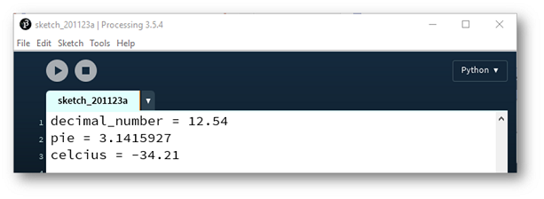
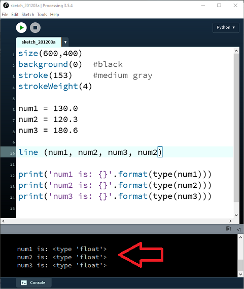

#Float Data Types

A Float is a floating decimal point that can hold negative and positive numbers. 

##Using Float Variables

Your code from the previous step defines three variables, num1, num2 and num3 as Integers:

~~~python
num1 = 130
num2 = 120
num3 = 180

print(num1)
print(num2)
print(num3)

print('num1 is: {}'.format(type(num1)))
print('num2 is: {}'.format(type(num2)))
print('num3 is: {}'.format(type(num3)))
~~~

Now change the values assigned to num1, num2 and num3 to be decimal point numbers i.e.:

~~~python
num1 = 130.0
num2 = 120.3
num3 = 180.6
~~~

Run your code again and you should see that the data type printed to the terminal has changed from *int* to *float*:

Save your work using the naming convention: *labXX_stepYY.py*, where *XX* is the number of the lab and *YY* is the number of the step.
