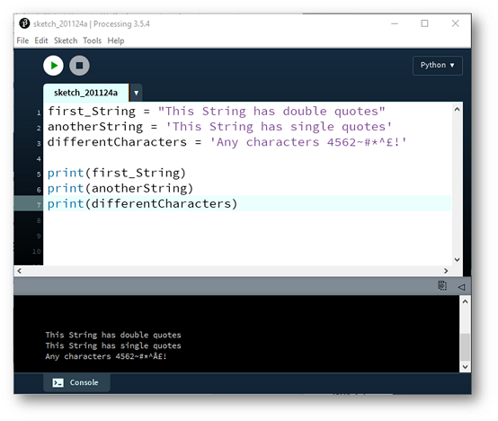

# String Data Type

We have looked at the Integer and Float numeric data types.  Now we will look at the String data type.  

A String is a sequence of characters inside double or single quotes. 

Create a new Python file in VS Code and try out the code:

~~~python
first_String = "This String has double quotes"
anotherString = 'This String has single quotes'
differentCharacters = 'Any characters 4562~#*^£!' 

print(first_String)
print(anotherString)
print(differentCharacters)
~~~

The *print* function prints whatever is passed between the () to the terminal.  In this case, we are printing the contents of our String variables that we created above.

Save your work using the naming convention: *labXX_stepYY.py*, where *XX* is the number of the lab and *YY* is the number of the step. 

