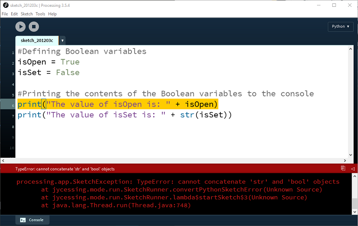

# Boolean Data Type

We have looked at the Integer, Float and String data types.  Now we will look at the Boolean Data Type.

A Boolean holds a value of either *True* or *False*.

Create a new Python file in VS Code and try out the code:  

~~~
isOpen = True
isSet = False

print("The value of isOpen is: " + str(isOpen))
print("The value of isSet is: " + str(isSet))
~~~

Run your code and you should see output similar to this appearing in the terminal:

~~~
The value of isOpen is: True
The value of isSet is: False
~~~

##print function

If we look at the first *print* function, we can see there are two pieces of information being passed to it, separated by the plus sign (+) :

~~~
print("The value of isOpen is: " + str(isOpen))
~~~

The first piece is:

~~~
   "The value of isOpen is: "
~~~

and the second piece is:

~~~
   str(isOpen)
~~~

What we have asked Python to do here is to add the *isOpen* variable to the String:

~~~
   "The value of isOpen is: "
~~~

However, isOpen is a Boolean and not a String, so we need to ask Python to convert the Boolean to a String before adding it:

~~~
   str(isOpen)
~~~

If you don't ask Python to convert it, you will get a syntax error e.g.:

Save your work using the naming convention: *labXX_stepYY.py*, where *XX* is the number of the lab and *YY* is the number of the step. 

