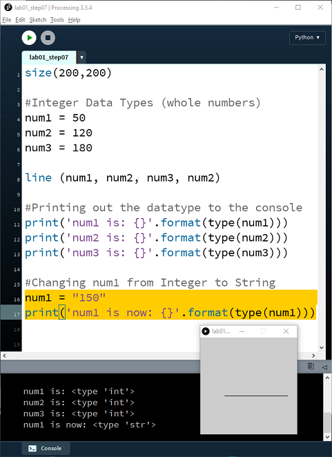

#More on Data Types

There are other things of note with Python datatypes e.g.:

- you can change a variables data type after it is declared
- you can assign one value to multiple variables in one line of code
- you can assign multiple values to multiple variables in one line of code

We will look at each one of these points in turn.  First, create a new Python file in VS Code and enter the following code:

~~~python
num1 = 50
num2 = 120
num3 = 180

print('num1 is: {}'.format(type(num1)))
print('num2 is: {}'.format(type(num2)))
print('num3 is: {}'.format(type(num3)))
~~~

When you run it, the datatype of each variable is printed to the terminal.

##Changing a variable's datatype

A declared variable can change its type, for example, from *Integer* to *String*.  

To try this out, add the following two lines of code after the existing code:

~~~python
num1 = "150"
print('num1 is now: {}'.format(type(num1)))
~~~

When you run the code, it will display the datatypes in the terminal — you will see that the type for *num1* has changed:

##One value for multiple variables

You can assign one value to multiple variables in one line of code.  We will now change the variable declarations for *num1*, *num2*, *num3* from:

~~~python
num1 = 50
num2 = 120
num3 = 180
~~~

to:

~~~python
num1 = num2 = 50
num3 = 180
~~~

where *num1* and *num2* are both assigned a value of 50.

Run the code and check that the printed types reflect this change.

##Multiple values for multiple variables

You can also assign multiple values to multiple variables in one line of code.  

Change the variable declarations to:

~~~python
num1, num2, num3 = 50, 120, 180
~~~

Run the code again and confirm all three variables are back to their original values.

##Functions and data types

Functions in Python expect arguments of particular data types.  For example, the built-in `print()` function accepts any type, but the `int()` function expects a value that can be converted to an integer.  Passing in the wrong type can cause a `TypeError`.

You can always check the expected types in the Python documentation at <https://docs.python.org/3/>.

Save your work using the naming convention: *labXX_stepYY.py*, where *XX* is the number of the lab and *YY* is the number of the step.
