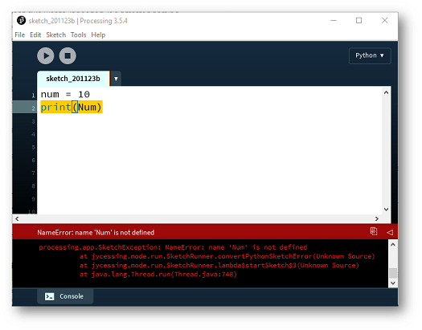
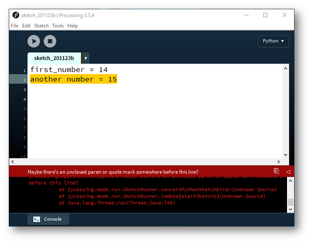
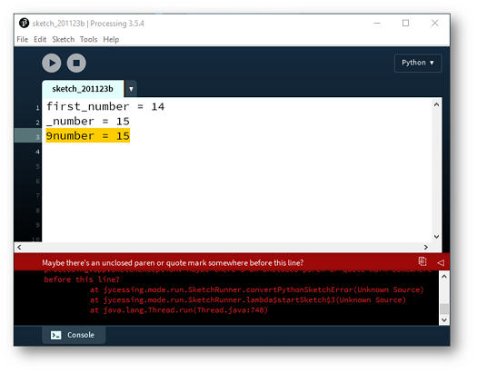
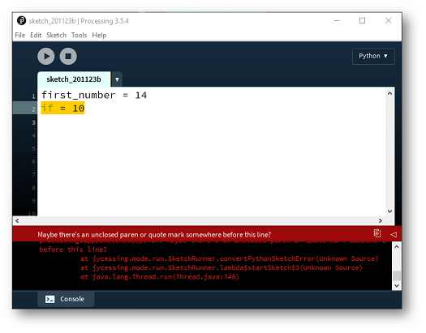

#Syntax Errors

As you worked through the previous exercises, you may have encountered some Syntax Errors.  These types of errors happen when you don't type the Python code in the right format.  We will be looking at a few Syntax Errors for datatypes here.  

It is a really good idea to create Syntax Errors in your code so that you become familiar with the error messages and how to fix them.  Learning by making mistakes is a very valuable learning experience in coding — the more mistakes you make, the faster you start recognising errors and the faster you get at fixing them. 

Create a new Python file in VS Code so that you can generate these errors and fix them.

##Case sensitive

Variable names are case sensitive.  Enter the following code into your file:

~~~python
num = 10
Print(Num)
~~~

The following error is generated because we are trying to print the contents of a variable called *Num* that doesn't exist (we defined *num*, not *Num*):

##No white spaces

Variable names cannot contain white spaces (i.e. the spacebar character). Enter the following code into your file:

~~~python
first_number = 14
another number = 15
~~~

The following syntax error is generated because *another number* contains a white space:

##Variable names must begin with letter or underscore

Variable names must begin with a letter or underscore.  Enter the following code into your file:

~~~python
first_number = 14
_number = 15
9number = 15
~~~

The following syntax error is generated because the *9number* variable name cannot start with a number:

##Variable names cannot be a reserved word

Variable names cannot be a reserved word.  Python has certain words that it uses to control the flow of a program e.g. if, while, for.  These belong to the programming language and cannot be used as variable names.   Enter the following code into your file:

~~~python
first_number = 14
if = 10
~~~

The following syntax error is generated because *if* is a reserved word:

BUT, because Python is case sensitive, we are allowed to call the variable *If* i.e.:

~~~python
first_number = 14
If = 10
~~~

##Variables must be defined before you use them

Variables must be defined before you use them. Enter the following code into your file:

~~~python
num1 = 50
num3 = 180

print(num1 + num2 + num3)
~~~

An error is generated because *num2* is not defined.

Now update the code so that num2 is defined, BUT place all variable definitions *after* the print statement:

~~~python
print(num1 + num2 + num3)

num1 = 50
num2 = 120
num3 = 180
~~~

An error is generated because Python cannot find the variables when it reaches the print statement — Python reads code from top to bottom.

##Values passed to functions should match the expected type

Functions expect arguments of a particular data type.  For example, the `int()` function converts a value to an Integer.  Enter the following code into your file:

~~~python
num1 = "50"
num2 = "120"

result = int(num1) + int(num2)
print(result)
~~~

This works because `int()` can convert a String of digits to an Integer.  

Now try passing a String that cannot be converted:

~~~python
bad = int("hello")
~~~

A `ValueError` is generated because *"hello"* cannot be converted to an Integer.  Python functions are strict about the types they can accept, and understanding these errors will help you debug your programs.

##Saving your work

There is no need to save the work in this step, as you were only experimenting with syntax errors.

