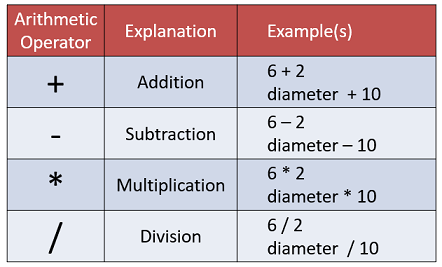

# Exercises

The exercises are typically based on the material we covered in the previous steps in this lab and the presentation slides.

For each exercise listed below, create a new Python file in VS Code.

In the presentation slides, we covered the following arithmetic operators: 

We will base the exercises on these operators. 

## Exercise 1 (addition)

In Step 3 of this lab, we used code similar to this:

~~~python
num1 = 50
num2 = 120
num3 = 180

print(num1)
print(num2)
print(num3)
~~~

Create a new Python file and, in it, update the above code so that you print four rows of values using **only** the addition arithmetic operator applied to num1, num2 and num3.

The first row should print the original values, and each subsequent row should add 20 to num1 and num2:

~~~
50 120 180 
70 140 180 
90 160 180 
110 180 180 
~~~

HINT: the second row is printed like this:

~~~python
print(num1 + 20, num2 + 20, num3)
~~~

Save your work.

## Exercise 2 (subtraction)

Create a new Python file and, in it, enter the same starter code from Exercise 1.

~~~python
num1 = 50
num2 = 120
num3 = 180
~~~

Print four rows using **only** the subtraction arithmetic operator on num1, num2 and num3.

The first row should print the original values, and each subsequent row should subtract 20 from num2:

~~~
50 120 180 
50 100 180 
50 80 180 
50 60 180 
~~~

HINT: the second row is printed like this:

~~~python
print(num1, num2 - 20, num3)
~~~

Save your work.

## Exercise 3 (division)

Create a new Python file and, again, enter the same starter code from Exercise 1.

~~~python
num1 = 50
num2 = 120
num3 = 180
~~~

Print four rows using **only** the division arithmetic operator on num1, num2 and num3.

The first row should print the original values, and each subsequent row should divide num2 by an increasing divisor:

~~~
50 120 180 
50 60.0 180 
50 40.0 180 
50 30.0 180 
~~~

HINT: the second row is printed like this:

~~~python
print(num1, num2 / 2, num3)
~~~

Save your work.

## Exercise 4 (combined operators)

Create a new Python file and start with your solution from Exercise 3.  If you had difficulty completing it, the solutions are available in the solutions tab.

Create three new variables, `num1`, `num2`, and `num3`, and assign them values of your choosing.

Experiment with different combinations of `+`, `-`, `*`, and `/` on all three variables and observe how the printed values change.

Save your work.

